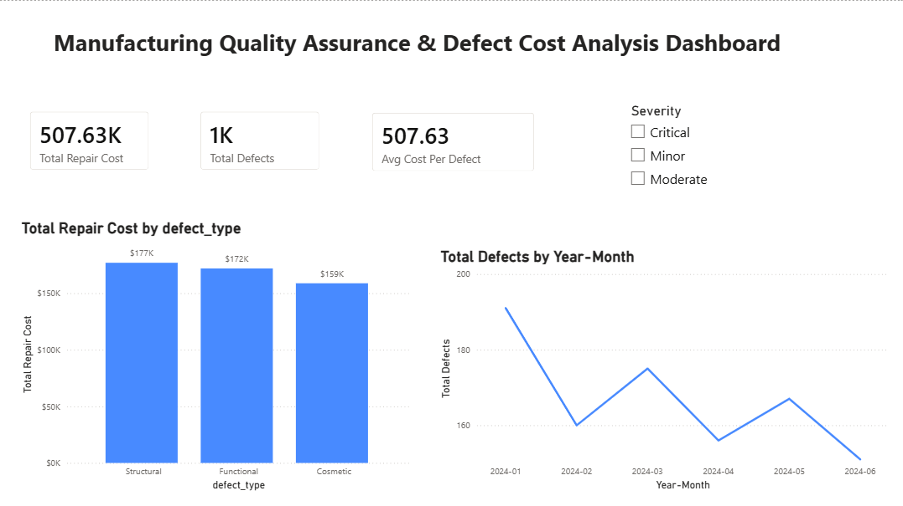
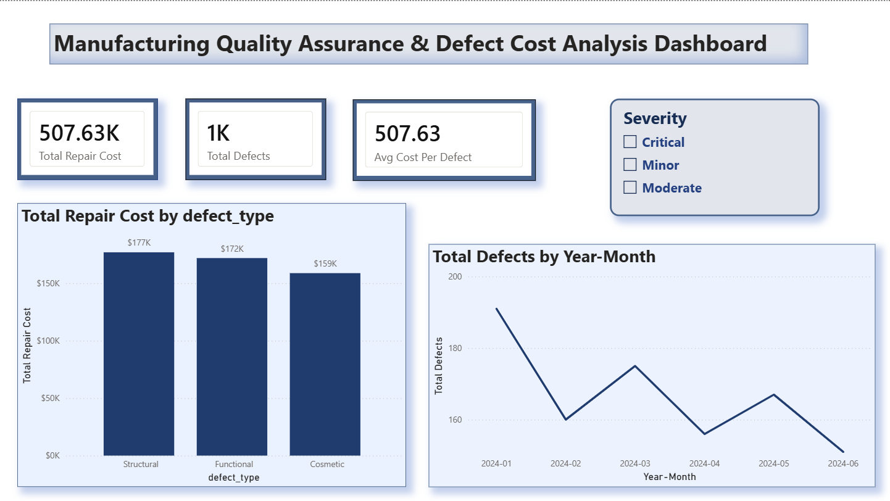

### Before Redesign
Default Power BI parameters with flat color palettes, uncontained layout structures, and standard formatting.

### After Redesign
Polished executive application framework featuring a unified slate-blue corporate color theme, soft container boundaries with 8px rounded corners, integrated drop shadows, clean data labeling, and a synchronized severity slicer.

